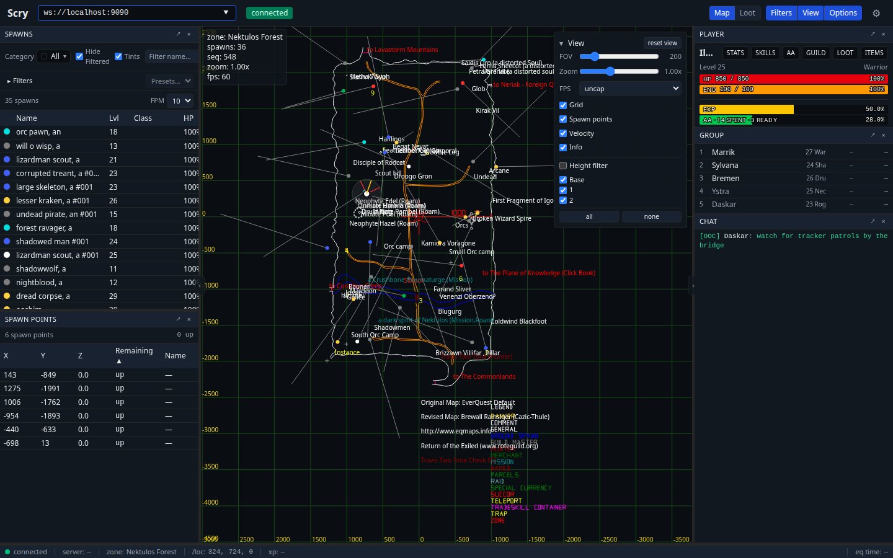
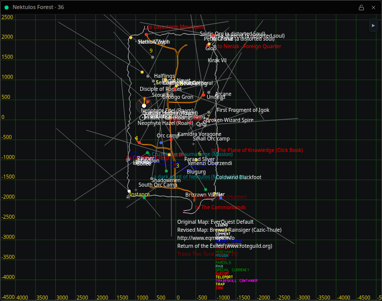

# Scry

Scry is a desktop and web client for live EverQuest state. It displays the
zone map, spawns, player and group state, buffs, chat, combat, loot, and other
data received from a compatible Scry daemon.

This repository is named `scry-web` because the same React application builds
as a browser client and an Electron desktop app. The shipped application is
named **Scry**.



Scry does not capture or decode EverQuest traffic by itself. It connects over
WebSocket to a daemon that implements the
[`seq.v1` Scry protocol](https://github.com/scry-eq/scry-proto). The official
server is [`scry`](https://github.com/scry-eq/scry), written in Elixir. Any
server that implements the protocol can drive this client, including
[`scry-cpp`](https://github.com/scry-eq/scry-cpp) and
[`scry-cpp-quarm`](https://github.com/scry-eq/scry-cpp-quarm).

## Download

Download the current desktop build from
[GitHub Releases](https://github.com/scry-eq/scry-web/releases).

| Platform | Builds |
| --- | --- |
| Windows | Installer and portable `.exe`, x64 |
| macOS | `.dmg` for Apple silicon and Intel |
| Linux | AppImage, x64 |

Releases are currently prerelease builds and are unsigned. Windows SmartScreen
and macOS Gatekeeper will warn when opening them. On Windows, use **More info**
and **Run anyway**. See [the signing notes](docs/signing.md) for the macOS
workaround and more detail.

## Connect to a daemon

1. Start a Scry-compatible daemon.
2. Open Scry.
3. Enter its WebSocket address in the field at the top of the window.

The default address is:

```text
ws://localhost:9090
```

If the daemon runs on another machine on your LAN, use that machine's address:

```text
ws://192.168.1.20:9090
```

Scry remembers addresses that connected successfully. The desktop app also
accepts an address through `SCRY_DAEMON_URL` or `--url` when the saved address
cannot be reached.

> A plain `ws://` connection is not encrypted. The current C++ daemons also
> provide no authentication. Keep their listeners on the local machine or a
> trusted LAN. Do not expose port 9090 directly to the internet. Use a TLS
> reverse proxy and authentication if the connection must cross an untrusted
> network.

## What Scry shows

- A canvas map with streamed zone geometry, map layers, spawn points, player
  tracking, field of view, height filtering, and spawn velocity
- A sortable spawn list with categories, name filters, presets, colors, and
  per-spawn inspection
- Player, target, group, guild, buff, skill, AA, inventory, and equipment data
- Chat, combat, experience, loot history, and recorded-loot browsing
- Configurable spawn alerts with sound, notifications, and speech
- Dockable panels, floating windows, resizable side rails, saved layouts, and
  light and dark themes

Availability depends on which protocol messages the connected daemon sends.
The client does not contain server-specific branches.

## Desktop overlays

The Electron app can open separate map and vitals windows from the **Overlay**
menu. These windows stay above the game, remember their position, and can lock
into click-through mode. Overlay windows can also snap to screen edges and to
one another on Windows and macOS.



Overlays are available only in the desktop app. EverQuest must run in windowed
or borderless-windowed mode. An exclusive fullscreen game renders above normal
desktop windows, so Scry cannot place an overlay on top of it. Some Linux
compositors and graphics drivers may render transparent windows as black.

See [the overlay documentation](docs/overlay.md) for click-through behavior,
placement, snapping, and platform limits.

## Item and spell artwork

Scry cannot distribute artwork from the EverQuest client. Published builds
therefore show item and spell names without icons. The UI detects missing
atlases and falls back to text without leaving empty icon boxes.

You can add artwork from your own EverQuest installation when building Scry
locally. Install [Pillow](https://pillow.readthedocs.io/) and run the conversion
script against the client's `uifiles/default` directory:

```sh
python3 -m pip install Pillow
python3 scripts/gen-item-icons.py "/path/to/EverQuest/uifiles/default"
```

On Windows, use `py` instead of `python3` if that is how Python is installed.
The script converts `dragitem*.dds` and `spells*.tga` into PNG sprite atlases
under `public/icons/`. Those files remain untracked. Run the script before
`bun run build` or `bun run electron:dist` to include them in your local build.

## Build from source

Scry uses [Bun](https://bun.sh/) for JavaScript tooling. Clone the protocol
submodule with the repository, install dependencies, and generate the
TypeScript protocol bindings:

```sh
git clone --recurse-submodules https://github.com/scry-eq/scry-web.git
cd scry-web
bun install
bun run gen
```

If the repository was cloned without submodules, initialize them before
running the generator:

```sh
git submodule update --init --recursive
```

### Run in a browser

```sh
bun run dev
```

Open <http://localhost:5173>. The browser build has the same main interface as
the desktop app, but it cannot create always-on-top overlay windows.

A page loaded over HTTPS can connect only to a secure `wss://` endpoint. For a
plain local `ws://` daemon, run the development server over HTTP or put a TLS
reverse proxy in front of the daemon.

### Run the desktop app

Bun does not run Electron's package installation script. Fetch the Electron
runtime once, then start the desktop development build:

```sh
node node_modules/electron/install.js
bun run electron:dev
```

`electron:dev` starts its own Vite server on port 5173, so stop any existing
`bun run dev` process first.

### Build distributable files

```sh
bun run build             # browser build in dist/
bun run electron:dist     # desktop package in release/
```

## Tests

```sh
bun run typecheck
bun run test
bun run test:e2e
bun run smoke
```

Playwright downloads its browser separately on a fresh development machine:

```sh
bunx playwright install chromium
```

CI runs the typecheck, unit tests, browser build, and Playwright tests on every
push and pull request.

## Project layout

```text
electron/       Electron main process, preload bridges, and overlay windows
src/components/ Shared UI components
src/gen/        Generated seq.v1 TypeScript bindings
src/lib/        EQ data tables and client utilities
src/net/        WebSocket client and daemon URL handling
src/overlay/    Map and vitals overlay renderers
src/recorder/   Loot recording and schema code
src/state/      Live session state, preferences, filters, alerts, and layout
src/ui/         Main application panels and map
docs/           Architecture, overlays, and release-signing notes
e2e/            Playwright tests
proto/          scry-proto git submodule
scripts/        Generators, diagnostics, and smoke tests
```

Contributor details live in [the architecture guide](docs/architecture.md).

## Stack

- React 19 and TypeScript
- Vite and Electron
- Tailwind CSS, Radix UI, and TanStack Table
- Zustand for persistent client preferences and shared UI state
- `@bufbuild/protobuf` for the `seq.v1` protocol
- Native WebSocket transport
- Vitest and Playwright

## License

Scry is available under the [MIT License](LICENSE).
